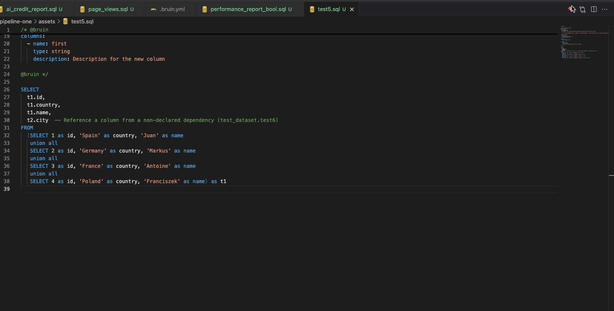

## Getting Started

Once you’ve installed the Bruin VSCode extension and configured your settings, you’re ready to start using its features. Follow these steps to get started:

### 1. Open a Supported File

The Bruin extension works with SQL, Python and YAML files. Open a file with one of these extensions in VSCode, or create a new one to get started.

### 2. Create a Bruin Section

To access Bruin features, add a Bruin section in your code. You can do this manually or with the extension’s predefined snippets. You can learn more about Bruin sections in the [Asset Definition](../getting-started/concepts.md) **Concepts** section under **Asset Schema Definition**.

- **Using Snippets**: Quickly create Bruin sections with these snippets:
  - **For SQL Files**: Type `!fullsqlasset` and select the snippet to insert a Bruin section. Or, create it manually like this:
    ```bruinsql
    /* @bruin
      Your Bruin-specific SQL commands or configurations go here.
    @bruin */
    ```

  - **For Python Files**: Type `!fullpythonasset` and select the snippet to insert a Bruin section. Alternatively, create it manually like this:
    ```bruin-python
    """@bruin
    Your Bruin-specific Python logic or configurations go here.
    @bruin"""
    ```

### 3. Use Syntax Highlighting and Autocompletion

Syntax highlighting is automatic in a Bruin section. If the section is written without formatting errors, the syntax should be highlighted in YAML colors. If it appears as a comment instead, check the structure to ensure there are no errors. Autocompletion is also available in `pipeline.yaml` and `.bruin.yml` files, allowing you to access relevant properties and values as you type, with a JSON schema to maintain accuracy and completeness.


### 4. Run Bruin CLI Commands

Run Bruin CLI commands directly from the extension:

- Use the command palette (`Ctrl + Shift + P`) and type the command you want, like `Bruin: Install Bruin CLI`.
- Or, use the buttons in the UI to run commands without needing the terminal.



### 5. Explore the Bruin Panels

The Bruin extension provides two main panels :

- **Side Panel**: Displays the current asset’s details with tabs for viewing asset information, columns, and settings.
- **Lineage Panel**: Found at the bottom of VSCode, near the terminal, this panel shows the asset lineage, giving you a visual of how the asset connects to other assets.

