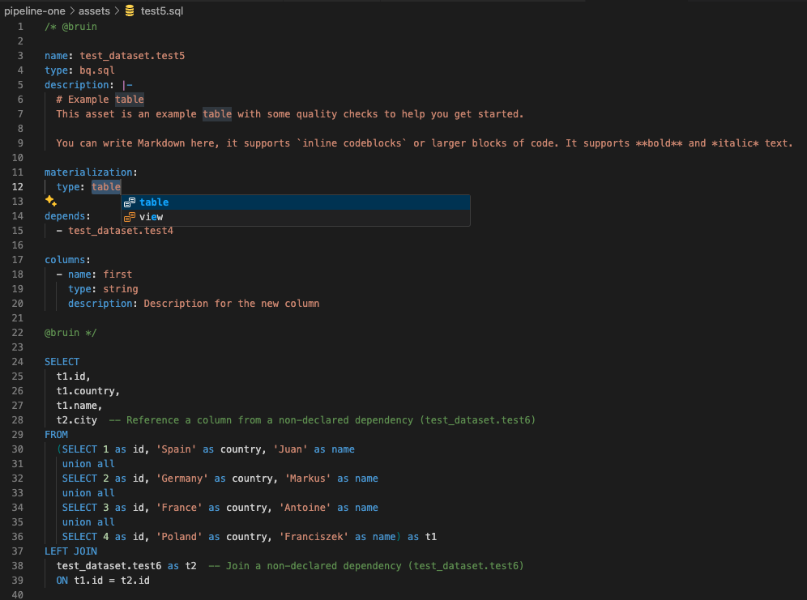
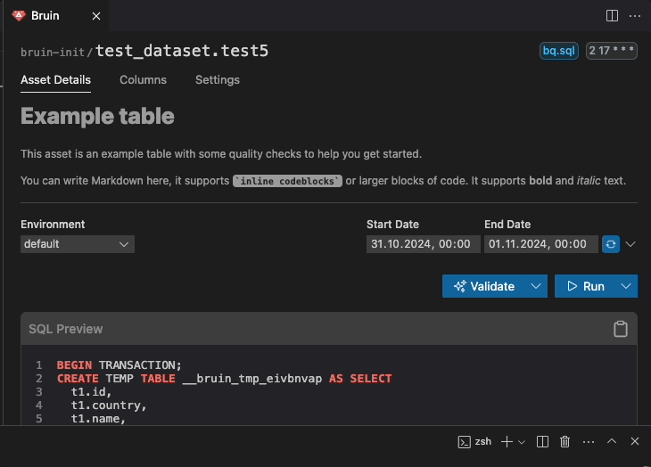
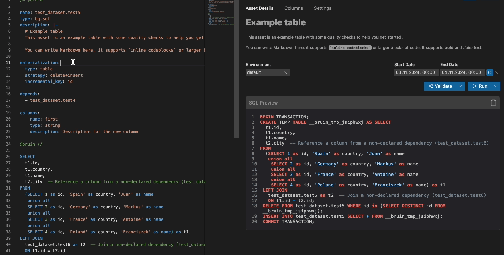

# Bruin VSCode Extension

The Bruin VSCode extension complements the Bruin CLI by offering a more visual and interactive approach to managing data pipelines. Integrated directly into VSCode, it simplifies tasks like building, managing, and deploying pipelines, making it easier for developers to interact with their projects. 

## Key Features

- **Syntax Coloring, Autocompletion, and Snippets**: Enjoy syntax coloring, autocompletion, and ready-to-use snippets to make coding smoother and more intuitive.



- **Bruin CLI Integration**: Run Bruin CLI commands effortlessly through easy-to-use buttons and panels.



- **Data Asset Lineage Visualization**: Get a clear view of how data assets connect and interact, helping you understand your data's flow and dependencies.


- **Real-time Updates and Feedback**: Stay informed with instant updates and error messages right in VSCode.


<!-- ### What is a Bruin Section?
A **Bruin section** refers to a block of code within SQL or Python files that is specifically designated for Bruin-related functionality. These sections are typically enclosed within specific delimiters, allowing the extension to identify and manage them effectively. Users can fold or expand these sections to improve code readability and organization.

#### Example of a Bruin Section in SQL
```bruinsql
/* @bruin
  This is a Bruin section in SQL.
  It can contain Bruin-specific commands or configurations.
@bruin */
SELECT * FROM users;
```
### Example of a Bruin Section in Python
```bruin-python
"""
@bruin
This is a Bruin section in Python.
It can include Bruin-related logic or configurations.
@bruin
"""
def fetch_users():
    pass
```

 -->